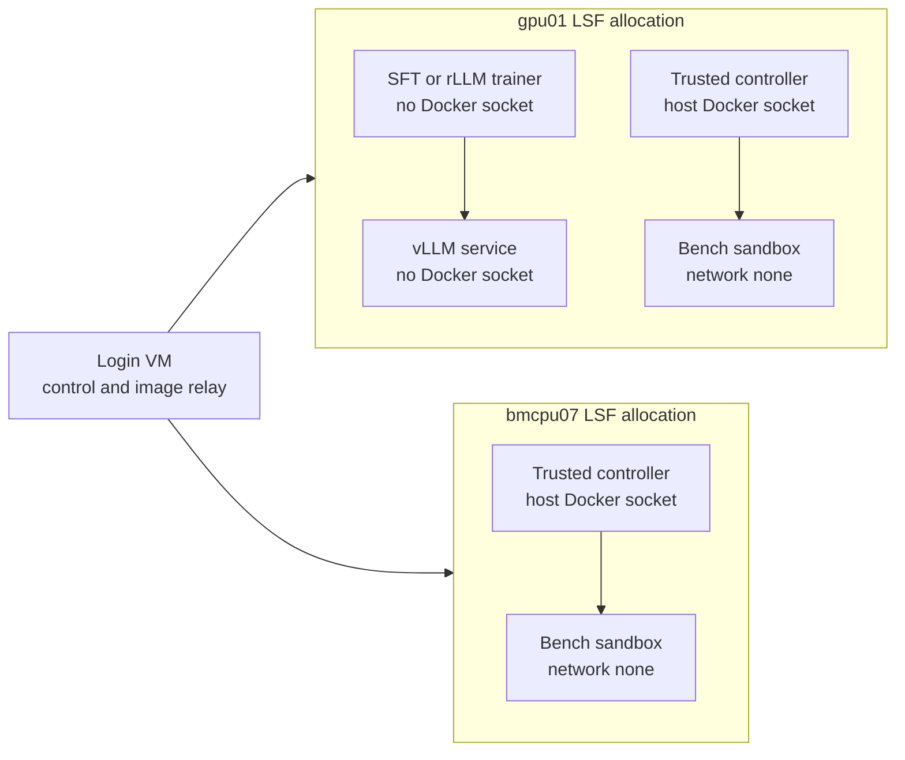

# Online RTL Training

VeriGym keeps policy training outside the evaluator package while providing three hash-bound
interfaces: frozen held-out evaluation, resumable campaign execution, and an optional rLLM/verl
online workflow. None of these interfaces makes held-out samples eligible for training.

## Deploy on the current HPC nodes

Both `gpu01` and `bmcpu07` expose Docker. Use the login VM only as a control plane and image relay;
do not route ordinary verification through it. Keep the existing LSF/tmux allocations alive.

| Workload | Preferred node | Container boundary |
| --- | --- | --- |
| vLLM, SFT, adapter reload | `gpu01` | Separate containers, four assigned GPU IDs |
| GPU-coupled online rollout | `gpu01` | Trusted controller plus sibling benchmark sandboxes |
| Qualification and CPU verification | `bmcpu07` | Controller plus sibling sandboxes |
| OpenHands SDK inference | Rollout node | Dedicated Python 3.12 env, broker tools only |
| Checkout, image transfer, scheduling | Login VM | No benchmark execution by default |

On hosts older than manylinux 2.28, build `litellm==1.93.0` from its hash-checked source archive
for the OpenHands Python 3.12 interpreter and pass that wheel through
`VERIGYM_OPENHANDS_LITELLM_WHEEL`. The environment preparation script constrains the matching
OpenTelemetry 1.39.1/0.60b1 family because unconstrained resolution can combine incompatible beta
semantic-convention releases. The local wheel is installed only into the OpenHands environment;
it is not copied into model, trainer, controller, or benchmark images.



This is sibling-container orchestration, not privileged Docker-in-Docker. Only the immutable,
audited controller image receives `/var/run/docker.sock`; that socket is host-equivalent authority.
OpenHands, provider CLIs, model servers, trainers, and benchmark sandboxes never receive it. Each
episode selects a digest-locked benchmark image and retains its own filesystem, resource limits,
network policy, ownership labels, and deterministic cleanup.

## Freeze and compare policies

`configs/training/qwen35_heldout_v1.json` selects a fixed 12-task VerilogEval V2 set spanning
combinational, sequential, LFSR, and FSM designs. Freeze it before sampling:

```bash
python scripts/freeze_qwen35_heldout.py \
  --config configs/training/qwen35_heldout_v1.json \
  --source "$VERILOG_EVAL_ROOT" --output "$EVAL_ROOT" \
  --training-public-input prior-task.json \
  --frozen-after-policy "$POLICY_VERSION_HASH"
```

Run `scripts/run_qwen35_heldout_policy.py` once per registered policy with identical sampling and
verifier arguments. `scripts/summarize_qwen35_heldout.py` then reports compile rate, resolved rate,
task-level pass@k, infrastructure-invalid count, and verifier wall time. The summary requires exact
task coverage and never silently turns infrastructure errors into zero rewards.

## Resumable campaigns

`verigym-training-reference run-campaign` executes a declarative JSON DAG without a shell. Each
stage declares dependencies, GPU IDs, retry policy, timeout, workspace-relative outputs, and a
workspace quota. Ready stages may run concurrently only when their GPU allocations do not overlap.
Completed outputs are hashed; resume skips an intact stage and fails closed if an artifact changed.
Only a small system environment allowlist is inherited, and credential-like variables are rejected.

```bash
verigym-training-reference run-campaign \
  --config configs/training/qwen35_rllm_verl_online_smoke_v1.json \
  --workspace "$CAMPAIGN_ROOT" --repository "$PWD"
```

Set `VERIGYM_OUTPUT_POLICY_ID` to the portable successor identity before launching. After the
online stage succeeds, the campaign writes `registered-policy/adapter/`, a hashed reward manifest,
and `registered-policy/policy-version.json`. The compact policy is registered as the exact
successor of `VERIGYM_INPUT_POLICY_VERSION`; the large resumable FSDP checkpoint remains a trainer
artifact and is not needed for evaluation.

## Full rLLM + verl smoke

The online smoke uses rLLM `AgentTrainer`, Ray, asynchronous vLLM rollout servers, verl GRPO, and a
VeriGym `Workflow`. The model receives two public turns (plan, then RTL). Training runs in a
network-disabled container that has neither the Docker socket nor the verifier source tree. A
host-side broker accepts hash-bound candidates, runs the evaluator-owned Docker verifier, and
returns only a sparse outcome and artifact hashes. Hidden testbenches and reference solutions never
enter model messages, trajectories, or the training container. Infrastructure-invalid verification
raises a retryable workflow error rather than producing reward zero.

The committed campaign is deliberately bounded to two training tasks, four rollouts per task, four
GPUs, and one optimizer update. It loads the registered input LoRA, saves a resumable verl
checkpoint, emits `online-completion-report.json`, and registers the changed LoRA as a compact
successor policy. The completion report qualifies interoperability and
weight synchronization only when at least one rollout group has reward variance; it is not a
convergence or benchmark claim. The pinned compatibility pair is rLLM `v0.3.0-pre` with verl
`v0.7.1`, which includes the upstream Qwen3.5 FSDP2/vLLM path.

## Use the split broker fallback

Clusters that expose Docker only on a login node can still keep the same trust boundary by running
`run_qwen35_online_broker_container.py` on that node and
`run_qwen35_online_native.py` inside the scheduler-owned GPU allocation. The trusted broker keeps
the prepared source in a role-labeled Docker volume and communicates through the existing
hash-bound filesystem protocol. The native trainer receives only the public task manifest,
bounded observations, sparse outcomes, model, adapter, and code; it receives no source-root or
Docker-socket argument. Both sides use a shared campaign directory for requests and responses.

This fallback is not the preferred topology on the current `gpu01`/`bmcpu07` cluster because both
compute nodes now provide Docker.

The three trusted GPU image launchers accept
`VERIGYM_GPU_DOCKER_SECCOMP_PROFILE=unconfined` as an explicit compatibility switch for legacy
Docker/seccomp stacks where `nvidia-smi` works but CUDA initialization fails with error 304. The
default remains Docker's built-in seccomp profile. Before using the switch, reproduce the failure
with an exact image ID and scheduler-owned GPU IDs. The switch does not enable privileged mode:
the launcher still drops every capability, sets `no-new-privileges`, uses a read-only root
filesystem and a non-root UID, and exposes only the scheduler allocation. It is restricted to the
digest-locked vLLM service, SFT trainer, and adapter reload images. Never propagate it to the
rollout controller or a benchmark sandbox, whose inputs and repository contents are untrusted.

The vLLM launcher fixes `VLLM_USE_FLASHINFER_SAMPLER=0`. In vLLM 0.22.1 the optional FlashInfer
top-k/top-p path may JIT-build a CUDA extension during engine profiling and requires `nvcc` even
before the first request. The PyTorch-native sampler avoids adding the CUDA compiler toolchain to
the serving image; Triton's model kernels still use the pinned minimal C compiler described below.

The GPU Docker launchers do not pass scheduler-visible numeric indices across the daemon boundary.
Some LSF installations cgroup-filter and renumber an allocation even though the host Docker daemon
still interprets numbers in its global device namespace. Each launcher therefore requires its
numeric request to equal `CUDA_VISIBLE_DEVICES`, resolves those visible indices to canonical GPU
UUIDs with `nvidia-smi`, rejects missing or duplicate identities, and gives Docker only the UUIDs.
This prevents an apparently correct `device=0,1,2,3` request from selecting another job's physical
GPUs after scheduler renumbering.

The frozen vLLM service image also carries a version-pinned minimal C toolchain. vLLM 0.22.1 uses
Triton to compile small launchers and Qwen3.5 model-specific kernels during engine initialization;
having CUDA libraries alone is insufficient. The image build compiles a Python-header smoke
library and records both the selected Debian package versions and compiler identity in its image
inventory. The compiler is available only inside the trusted, digest-locked model-service image,
not inside benchmark sandboxes.

Some HPC sites replace `docker` with a wrapper that delegates to a sibling executable. In that
case the broker launcher accepts `--docker-helper` only together with
`--expected-docker-helper-sha256`, verifies that it is a distinct sibling of the selected Docker
executable, and mounts only that fixed file read-only. Do not mount the containing system binary
directory into the broker container.

Native Ray temporary roots must be private and at most 35 encoded pathname bytes. This reserves
the complete timestamp, maximum Linux PID, and `dash_MetricsHead` suffix under the 107-byte Linux
AF_UNIX pathname limit; a longer root fails preflight instead of silently disabling a dashboard
subprocess.

The native launcher requires a numeric scheduler-provided `CUDA_VISIBLE_DEVICES`, samples GPU
contention before importing PyTorch, and supports 4, 6, or 8 GPUs. It couples world size, FSDP
size, rLLM parallelism, and GRPO rollout group size (`n=N`) and writes the resolved values to a
hash-bound `native-training-runtime.json` before the first model call. `--gpu-count auto` uses the
largest supported uncontended subset; a fixed count fails closed when insufficient GPUs are clean.
Different topology hashes are different runs even when task and policy inputs are unchanged. The
runtime also binds the exact rLLM, verl, and Transformers source commits.

On an older host ABI, the native launcher may be invoked from an explicitly qualified PRoot
userspace with `run_qwen35_online_proot.py`; the inner launcher receives both
`--proot-executable` and `--proot-rootfs-identity`. The launchers fail
unless PRoot seccomp acceleration is disabled, then binds the executable SHA-256, exported rootfs
image ID, host kernel, and guest glibc to the runtime manifest. Paths are never persisted. This is
an ABI compatibility mechanism, not a relaxation of the broker/source separation.

When PRoot's process tracing is incompatible with Ray or NCCL multiprocessing, use the narrower
`run_qwen35_online_glibc.py` path. It verifies a regular Python executable whose ELF interpreter
and transitive RPATH are pinned to the exported userspace, plus the patched-Python, dynamic-loader,
patchelf, and rootfs image hashes. The launcher also verifies that the active Python NCCL link
resolves to the hash-pinned build, binds its source commit and CUDA build version, and pins the C
compiler used by runtime kernel builds. Caller-owned mode-0700 short temporary directories are
required for process-local and Ray IPC sockets; the Ray root has a stricter byte-length bound. It
removes inherited loader and proxy variables before launch.
This preserves native process creation while changing only the userspace glibc; it does not expose
the prepared source, Docker socket, hidden tests, or credentials to the trainer. Runtime manifests
record these identities without raw host paths.

The bounded repository smoke config keeps vLLM resident by disabling both `enable_sleep_mode` and
`free_cache_engine`. This avoids vLLM's CUDA virtual-memory sleep allocator on legacy-driver nodes;
FSDP parameter and optimizer offload, a 0.47 vLLM memory envelope, and 256 MiB weight-transfer
buckets keep the A30 envelope bounded. A clean four-card A30 attempt at 0.4 loaded the model but
could not allocate even one KV-cache block, before any rollout or broker session, so 0.4 is not a
viable envelope for this frozen model and context. A prior 0.5 attempt reached rollout generation
but exhausted memory during actor log-probability computation on non-exclusive GPUs. A subsequent
job-exclusive four-card attempt reproduced the actor unshard failure: the resident vLLM process
used 12.40 GiB and the actor process used 10.13 GiB, leaving less than the 1.89 GiB required by the
next FSDP all-gather. The repository smoke therefore enables FSDP2's native actor CPU-offload
policy while retaining a rollout envelope above the known-inviable 0.4 setting and job-exclusive
scheduling. A multi-card native run shards the actor over all scheduler-owned GPUs while keeping
tensor parallelism at two.
Reducing the envelope from 0.5 to 0.48 allowed the same frozen workload to complete all four
rollouts and enter `update_actor`, but recurrent-attention forward still had only 229.50 MiB free
when it requested 256 MiB. The 0.47 envelope reserves approximately another 240 MiB per A30 while
remaining above the known-inviable 0.4 setting.
With actor parameters offloaded, a maximum-length repository trajectory exposed a separate peak:
the ordinary causal-LM head attempted to materialize the complete 32K-by-248,320 logits tensor.
The repository smoke therefore also uses verl's fused PPO linear head with its Torch backend. That
implementation computes token log probabilities and entropy in bounded 512-token vocabulary
chunks without shortening the frozen 16K prompt and 16K response limits. Verl 0.7.1's fused head
reads the independently wrapped FSDP2 `lm_head` weight without invoking that module's forward
hook, leaving a sharded `DTensor` next to ordinary hidden-state tensors. The pinned external
Qwen3.5 compatibility module therefore leaves `lm_head` in the root FSDP2 unit instead of wrapping
it independently. The root pre-forward hook exposes the complete CUDA weight to the chunked
projection, and the normal root post-forward/backward lifecycle reshards and CPU-offloads it. The
selector adjustment is restricted to Qwen3.5; other models keep verl's original wrap policy. It
lives in a separate opt-in external-lib module selected only by the FSDP2 Torch-fused repository
configuration, so non-fused and non-FSDP2 Qwen3.5 runs also retain the original policy.
Weight synchronization remains enabled, and the completion report still requires a changed output
adapter.
The pinned rLLM release interprets `workflow.retry_limit` as the total attempt count, so the
repository smoke uses `retry_limit=1` for exactly one attempt and no retry.
Repository responses are append-only: ordinary `turn-N.json` observations remain immutable and
the broker publishes one independent `terminal.json`. The workflow races every generation against
that terminal and cancels an obsolete generation when the environment finishes first. The HWE
task's 3600-second wall budget is measured once from session start rather than restarted for each
action. The trainer allows 300 seconds for terminal publication and another 300 seconds for outer
workflow cleanup (3600/3900/4200 seconds respectively). A model that fails to provide the next
action before the episode deadline is an evaluable zero-reward model timeout, not an
infrastructure-invalid verifier outcome.

Native execution is opt-in. First freeze the Conda package inventory, verify a CUDA tensor, NCCL
collective, and vLLM load on the selected node, then run the zero-model base-FAIL/reference-PASS
qualification through the broker. A driver, image, package, or verifier mismatch is an
infrastructure failure and must stop before online training.

Scheduler allocation must also prevent another job from entering an already selected GPU for the
duration of the update. On LSF clusters that default to shared GPU scheduling, request
`mode=shared:j_exclusive=yes`: this retains the multiple CUDA processes required by FSDP and vLLM
inside the training job while excluding unrelated LSF jobs from those GPUs. A clean preflight is
necessary but cannot substitute for scheduler enforcement after the trainer starts. Preserve the
effective GPU requirement in the run audit and treat a non-exclusive shared allocation as
infrastructure-invalid for a real optimizer-step qualification.
